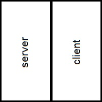

# Librería de comunicaciones


## Aspectos generales

### Nociones básicas de la red

Esta librería proporciona a una máquina una conexión P2P sobre el protocolo TCP/IP en una red local. Para ello el **punto**, así es como se va a nombrar a partir de ahora cada máquina conectada a la P2P, tiene una lista de IPs de otros puntos de la red así como un servidor para que otros puedan conectarse a él.



La lista inicial de IPs sirve para conectar a otros puntos de la red y así conformar la estructura básica de la red. La red se conforma mediante conexiones punto a punto. Para obtener una red funcional cada uno de los puntos de la red debe tener al menos un punto que lo conecte de forma que cualquier punto tenga al menos un camino hacia otro punto arbitrario de dicha red.


Se pueden realizar conexiones redundantes así se puede asegurar que si uno de los puntos por alguna razón pierde su conexión con otro las demás partes de la red no quedan desconectadas.


### Comportamiento de un punto

Dos puntos se pueden apuntar uno al otro mediante su lista de conexión incial (el cliente de uno intentará conseguir una conexión con el servidor del otro) pero el sistema interno de la librería asegura que sólo haya una comunicación entre dos puntos, por lo que descartará la segunda conexión que se podría establecer. La conexión más rápida en afianzarse entre los dos puntos es la ganadora.

Cuando un punto se conecta al servidor del otro, aunque este último no lo tenga en su lista de direcciones inicales lo incluye en su lista de conocidos (a partir de ahora llamados vecinos).

El sistema interno de la librería intentará conectarse de forma regular con los puntos de su lista de vecinos que se encuentren desconectados, eso es, de forma natural intentará conectarse con los puntos de la lista inicial y de los restantes que se han conectado a él al menos una vez.

Hay que tener en cuenta que si el programa se cierra, al arrancar de nuevo en su lista de vecinos sólo estarán los de la lista inicial olvidando así todas las conexiones nuevas que se pudieran haber realizado. Si este arranque se produce dentro de una red que ya estaba funcionando todos los puntos activos que se hubieran conectado con este intentarán la reconexión, por lo que en pocos segundos la red tiene la misma configuración que había antes de este se hubiera cerrado.

 

---


## Mensajes en la red

### Forma interna

Un mensaje en esta red está basado en los actuales protocolos existentes formados por capas. La aplicación que usa la librería le entregará a esta un objeto (**payload**, a partir de ahora), la librería envolverá este objeto en el suyo propio, que a partir de ahora será llamado **cabecera**, para después distribuirlo. Los siguientes puntos por donde pasa el mensaje mirarán dentro de esta cabecera y según los datos que haya en ella actuará de una forma u otra, por ejemplo quedándose con el contenido, redistribuyendo el mensaje, ambas acciones o simplemente dejando que el mensaje muera allí mismo (podría ocurrir al encontrarse con un mensaje que ha mandado él mismo). Así todo el conjunto constituye un **frame** (esta nomenclatura será sinónimo a mensaje pudiendose ver de forma indistitna durante el presente texto) pues constituye el marco de la unidad que viaja por la red.

Un frame está formado por las diferentes secciones:

| Encabezado                                                                    | Payload                     |
|:-----------------------------------------------------------------------------:|:---------------------------:|
| Tipo de frame<br/>Identificador de mensaje<br/>Ip de origen<br/>Ip de destino | Objeto serializable de Java |

Donde:

- Tipo de frame: Informa del motivo de la transmision. Pueden ser:
  
  - MessageFrame: El frame contiene un payload que debe ser entregado a otro punto.
  
  - PingFrame: Usado si un punto quiere saber si tiene conexión con otro. No es posible insertar un payload.
  
  - PingAckFrame: La respuesta a PingFrame. No es posible insertar un payload.
  
  - CloseFrame: Usado por un punto para informar a otro que se va a desconectar de la red. No es posible insertar un payload.

- Identificador de mensaje: Número de identificación del mensaje.

- Ip de origen: Ip del punto que envía el mensaje

- Ip de destino: Ip del punto al que va dirigido el mensaje. Tiene la peculiaridad de que si se encuentra un asterisco ( * ) el mensaje va para toda la red.

- Payload: Un objeto Object de Java que ha implementado la interfaz `Serializable`.
  
  

### Enrutamiento de un frame

Hay dos formas de mandar un mensaje: de forma privada a un a Ip o un mensaje global para toda la red (a la que llamaremos **flood**). En ambos casos casos el sistema de enrutamiento funciona de la misma forma, la diferencia es que en un mensaje privado sólo el receptor va a atender al contenido del mensaje y dejará de reenviarlo, los demás puntos sólo se dedicarán a reenviarlo; por otra parte un mensaje flood será tratado por cada receptor y reenviado a todos sus vecinos.

#### Reenvío de mensajes

La librería tiene diferentes formas de enviar y reenviar un mensaje y depende de las ips de origen, destino y de su lista de vecinos. Se debe tener un cuenta que un mismo mensaje puede moverse a la vez por distintas ramas de la red a la vez de tal forma que éste podría llegar al punto que lo emitió. Cómo se verá más adelante la librería también tiene un mecanismo para evitar que un mensaje entre en un bucle. La formas de reenviar un mensaje son las siguientes, las siguientes reglas se siguen en orden de prioridad:

1. La ip de origen es la del propio punto: El mensaje es descartado y no se reenvía.

2. El id del mensaje es menor o igual al que tiene en una lista de mensajes vistos: El mensaje es descartado y no se reenvía.

3. La ip de destino está en la lista de vecinos: El mensaje únicamente será enviado a esa ip. No será tratado.

4. La ip de destino no está en la lista de vecinos: El mensaje se distribuirá entre todos los vecinos. No será tratado.

5. La ip de destino es un asterisco ( * ): El mensaje es tratado según su tipo y es reenviado a todos los vecinos.

#### Mensajes duplicados

El enrutamiento de mensajes hace que estos se envíen de forma simultanea por toda la red. Esto puede ocasionar que un punto reciba en momentos diferentes el mismo mensaje (que tenga la misma id), además podría ocasionar que un mensaje se quedara dando vueltas en un bucle de de la red. Para solucionar este problema la librería guarda en un diccionario, una lista de pares clave/valor, la ip de los mensajes que han pasado por él y el id del mensaje de esa ip de mayor valor. De esta forma se descartan los mensajes antiguos.

La forma de proceder es la siguiente:

1. Al recibir un mensaje mira la ip de origen.

2. ¿Está la ip de origen en su diccionario?
   
   1. Sí: ¿La id del mensaje es mayor a la guardada en el diccionario?
      
      1. Sí: procede con el mensaje de la forma descrita en *Enrutamiento*.
      
      2. No: Descarta el mensaje y no lo redistribuye.
   
   2. No: Incluye la ip junto al id del mensaje en el diccionario.

3. Fin
   
   

---


## Uso de la librería

### Instalación

La versión mínima de uso es Java 10 con framework headless.

Incorporar la librería en un proyecto es tan sencillo como situar en la carpeta src todo el contenido de package communications. Además es necesario situar en la raíz del proyecto el archivo `connections.properties` con el siguiente contenido:

```
server_port=<puerto_del_servidor>
peers=<lista_de_peers>
```

donde:

- `<puerto_del_servidor>`: Es el puerto que la aplicación va a escuchar para nuevas conexiones. Ejemplo: 1234

- `<lista_de_peers>`: Es una lista de ip separadas por comas de las cuales la aplicación intentará conectarse. Ejemplo: 

```
server_port=1234
peers=111.111.111.111,222.222.222.222
```


### Inicialización

Para inicializar la librería hay que llamar al constructor sin argumentos de la clase `ConnectionController`.

Seguidamente hay que darle a la librería, a través del método `setCommListener` de la instancia del punto anterior, un objeto que herede de la interfaz `P2PCommListener`. Éste será el encargado de recibir los mensajes provinentes de la red y otra información de interés que la librería pudiera dar.

El objeto que vaya a darle ordenes a la librería, por ejemplo enviar un mensaje a tal IP, debe referenciar el objeto creado al instanciar `ConnectionController`.

Una vez configurado todo el marco de trabajo hay que poner la librería en marcha llamando al método `initialize()` de susodicha instancia de `ConnectionController`.

En el siguiente ejemplo puede verse todo el proceso:

```java
var comm = new ConnectionController();
var messenger = new Messenger(); // Messenger hereda de la interfaz P2PCommListener
messenger.setComm(comm);
comm.setCommListener(messenger);
comm.initialize();
```


### API

Esta librería, además de crear una red P2P también ofrece una serie de herramientas para facilitar al máximo al usuario de la red el poder comunicarse con ella haciendo transparente los pormenores de la conexión, el matenimiento de la sesión con la red e incluso la reconexión a la misma en caso de que haya ocurrido un error en el canal de transmisión.


#### Mensajes salientes

Los siguientes métodos son expuestos por *una instáncia* de la clase `ConnectionController` y nos permiten enviar mensajes a la red.


##### Mensajes para toda la red

```java
void sendFlood(Object message)
```

Este método lanza el mensaje *message* que debe ser escuchado y tratado por cada punto de la red, para ello se debe hacer una llamada a `sendFlood(Object message)` a la instancia de `ConnectionController`. Esto hará que se entregue a cada vecino una copia del mensaje. Estos vecinos trataran esos mensajes y los reenviarán a los vecinos que tengan asociados, repitiendo este comportamiento hasta que todos puntos conectados a la red hayan recibido el mensaje.

El siguiente ejemplo muestra el uso de este método.

```java
var message = new RequestShipIdMessage();
message.petitionaryId = hashCode();
message.team = team;
comm.sendFlood(message);
```


##### Mensaje privado

```java
void sendPrivate(String ip, Object message)
```

El método lanza el mensaje *message* hacia la red. Sólo el punto que tiene la misma ip a la que hace referencia *ip* va a leer el mensaje, los demás puntos por dónde pase lo van a ignorar y sólo lo reenviarán.
El punto que no comparta la *ip* del argumento reenviará el mensaje con la siguiente condición:

Si el punto tiene un vecino con la *ip* del argumento únicamente lo retransmitirá a este, en caso contrario retransmitirá el mensaje a todos los vecinos.

El siguiente ejemplo muestra el uso de este método:

```java
comm.sendPrivate("192.168.0.32", String.valueOf(0));
```


##### Desconexión voluntaria

```java
void sendDisconnectionAdvise()
```

Si el punto va a salir de la red de forma controlada debe usar este método. Este manda un aviso a todos sus vecinos informando que la desconexión será voluntaria. Los vecinos eliminarán al punto de su lista de conocidos por lo que no intentarán reconectarse con este una vez que salga de la red. Este mensaje no será redistribuido.


#### Mensajes entrantes y otros eventos

La librería se comunica con el programa anfitrión haciendo uso de la interfaz `P2PCommListener`. Estos métodos deben ser definidos por el anfitrión para que realicen un trabajo últil. Dado que se ejecutan cuando ha ocurrido algo ajeno a la voluntad propia del programa anfitrión también se les puede llamar eventos. Los métodos expuestos por la interfaz tienen los siguientes significados:


##### Mensaje entrate

```java
void onIncomingMessage(String ip, Object message)
```

Se dispara cuando llega un mensaje que debe ser interpretado, ya sea porque ha sido enviado como mensaje privado o como mensaje global.

El argument *ip* indica la dirección de procedencia del mensaje.

El argumento *message* es el cuerpo del mensaje. La interfaz usa el tipo Objeto por ser la clase base en Java y por consiguiente representar cualquier clase del lenguaje. Normalmente el menaje auténtico vendrá de una clase más especializada. La forma más sencilla de recuperarla es conocer qué tipos de mensajes van a circular por la red según la aplicación que se le vaya a dar y usar el operador *instanceof*  para preguntar su identidad real en una cadena de if-else.

Un ejemplo de código que realiza este trabajo podría ser el siguiente:

```java
@Override
public void onIncomingMessage(String ip, Object message) {
    if (message instanceof ShipScreenChangeMessage) {
        var m = (ShipScreenChangeMessage) message;

        // hacer algo

    } else if (message instanceof AccelerateShipMessage) {
        var m = (AccelerateShipMessage) message;

        // hacer algo

    } else if (message instanceof RotateShipMessage) {
        var m = (RotateShipMessage) message;

        // hacer algo

    } else if (message instanceof RequestShipIdMessage) {
        var m = (RequestShipIdMessage) message;

        // hacer algo

    } else if (message instanceof IdScreenMessage) {
            IdScreenMessage m = (IdScreenMessage) message;

        // hacer algo

    }
}
```


##### Conexión nueva establecida

```java
void onNewConnection(String ip)
```

Se ha establecido una conexión con un vecino. La dirección de red de dicho punto viene dada por el argumento *ip*.

La librería ya se encarga de manejar internamente esta conexión, la reconexión en caso de caída accidental y demás trabajos de bajo nivel. A nivel de aplicación puede resultar interesante conocer los vecinos que hay conectados para realizar tareas a más alto nivel con ellos.


##### Conexión perdida

```java
void onConnectionLost(String ip)
```

Un vecino se ha desconectado de forma inesperada. La dirección de red del vecino vienen dada por el argumento *ip*. Internamente la librería, periódicamente, intentará la reconexión con dicho vecino. Puede resultar interesante a nivel de aplicación tener conocimiento de esta caída temporal de un vecino, por ejemplo no se elimina una acción u objeto vinculado a éste, pero se deja de enviarle mensajes hasta que se vuelva a conectar, de esta forma la aplicación no gasta tiempo ni recursos pero si el vecino se reconecta no se habrá perdido su configuración.


##### Conexión cerrada

```java
void onConnectionClosed(String ip)
```

Un vecino se ha desconectado de forma voluntaria. La dirección de red del vecino viene dada por el argumento *ip*. Internamente la librería lo borrará de su lista de vecinos y no intentará reconectarse a este. Una desconexión voluntaria suele suceder cuando un punto desea salir de la red. Puede resultar interesante a nivel de aplicación tener conocimiento de este cierre definitivo de un vecino porque se pueden liberar todos los recursos que estaban vinculados a este, liberando memoria y tiempo de proceso en el programa.


---


## Errores comunes

### Puerto de servidor sin definir

En el archivo `connections.properties` no se ha definido la propiedad **server_port** con un número comprendido entre 1024 y 65535. La librería no puede iniciar su servidor ni conectarse a los otros clientes que deben usar el mismo número.

Para solucionar el problema hay que definir de forma correcta dicha propiedad en el archivo.


### Puerto de servidor en uso

Si al iniciar el socket de servidor la librería lo encuentra ocupado lanzará un error y cerrará la aplicación. Esto puede ser debido a que otra aplicación hace uso de él o que se ha arrancado la aplicación cuando ya se está ejecutando otra.

Para solucionar el problema se debe cerrar la aplicación que ocupa el puerto o elegir otro número de puerto en el archivo `connections.properties`.


### La conexión cae frecuentemente

Son varias las causas que pueden producir este error. Para ello es útil que revise el log que deja la aplicación por la salida estándar (normalmente la consola).

Puede ocurrir que la conexión sea de mala calidad. Revise las propiedade de conexión con herramientas de su sitema operativo.

Si está desarrollando haciendo uso de la librería observe que no haya problema con la serialización de los objetos que quire enviar como mensaje.

De igual modo fíjese si deserializa correctamente los mensajes que provienen de la red.
